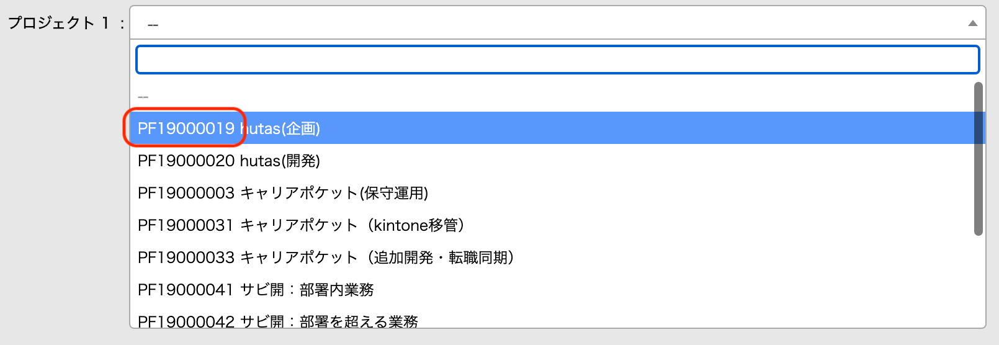

# Auto Kinpochi

Auto Kinpochiは勤怠入力というなんの生産性もない作業を自動化させるために誕生しました。

現在は、Miteras（パーソルプロセスアンドテクノロジー制作）に対応しています。

# 動作環境

このツールを利用するために、 Node.js / Yarn が必要です。可能な限り最新版をご利用ください。

# 使い方

`todaysjob.txt` というファイルを作成し、下記のフォーマットで本日の分報を必要な行だけ作成してください。休憩の場合は、 `(休)` などのように、先頭が時間と認識できない文字列を入れてください。

```
m/d
hh:mm - hh:mm プロジェクトコード 備考
```

具体的な例はこのようになります。

```
8/31
09:00 - 12:00 PJ1 MTG
(休)
13:00 - 17:00 PJ2 モクモク作業
17:00 - 18:00 PJ2 MTG
(休憩)
18:30 - 19:00 PJ1 議事録作成
```

その後、 `yarn kinpochi` コマンドを実行すると、今日の日付の勤怠としてMiterasへ情報が入力されます。

# 初期設定

1. このリポジトリをクローンします
1. クローンしたフォルダに入り、 `yarn` コマンドを実行します。
1. `.env.sample` を参考に、MiterasへログインするためのIDパスワードが入力された `.env` ファイルを作成します
1. `mapping.sample.json` を参考に、Miterasに登録されているプロジェクトコードと、分報に記載されるプロジェクトコードの退避表を作成します。用意されたサンプルの場合だと、 `PJ名1` と入力した行の分報は、プロジェクトコード `PF19000001` と読み替えられます。プロジェクトコードがわからない場合は、Miterasにログインし、適当な日にちの勤怠を選択肢、プルダウンメニューからプロジェクトを選択するプルダウンメニューを展開すると表示されています。
1. `yarn tsc` コマンドを実行します

これで実行できるようになりました。

# オプション

`yarn kinpochi yyyy-mm-dd` と入力すると、指定日付の勤怠に読み替えて情報を入力します。

# わかっている既知のバグ

1. Miterasの反応が悪い時、エラーが出る
1. 手動で一度勤怠入力して途中保存している場合、Miterasのエラーが出る
1. 頑張ってエラーハンドリングしていない

こまったら Ctrl+C で止めてください…

# デバッグ方法

Headless Chromeで動くので、処理結果のデバッグは `debug` フォルダにステップごとにスクショを撮ってありますので、そこから類推することになります。

# 免責事項

要はスクレイピングしているので、Miteras側の仕様変更で急に動かなくなる可能性があります。

# 連絡先

何かあれば江口まで。PR歓迎です。
